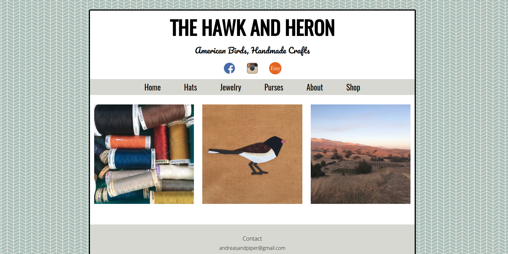

# The Hawk and Heron 
> A collection of images and information about products designed and created by Andrea Wayte. The Hawk and Heron is a personal craft business catering to bird and nature enthusiasts. 

### Technologies
* HTML5
* CSS3
* Jekyll static site generator
* Liquid templating
* Github Pages

### About the Project
> The idea stemmed from the need for a more attractive and easy to use website to display my crafts. I was previously using Wordpress and felt I did not need all the added features and struggled finding a template I liked. Liquid rendering easily loops through a list of images and created DOM objects on the page. A future goal for this website is to incorporate ecommerce. 
